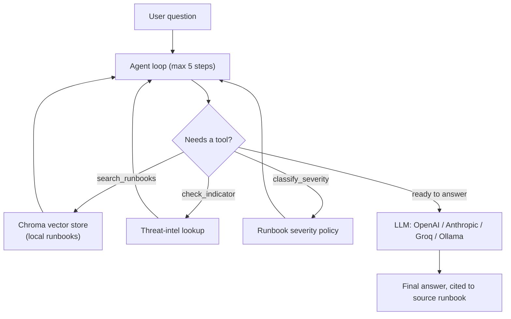

# SecOps Copilot

[](https://www.python.org/downloads/)
[](https://opensource.org/licenses/MIT)


I built SecOps Copilot as a retrieval-augmented, tool-using AI assistant for security operations. As a full-stack developer finishing my M.S. in Computer Science who previously worked as a SOC analyst at TPI Composites, I wanted to build something grounded in reality. It answers questions like *"a user entered their password on a phishing page, what do I do?"* by searching a local library of security runbooks, checking indicators of compromise against a threat-intel lookup, and reasoning step by step about which tool to call before giving a grounded, cited answer.

## Table of Contents
- [Why this project](#why-this-project-)
- [Architecture](#architecture-)
- [What it demonstrates](#what-it-demonstrates-)
- [Setup](#setup-)
- [Running this for $0](#running-this-for-0-)
- [Using it](#using-it-)
- [Running the eval suite](#running-the-eval-suite-)
- [Extending this project](#extending-this-project-)
- [Design decisions](#design-decisions-)
- [Contributing](#contributing)

## Why this project 🔍

I deliberately built this around a security-operations domain instead of a generic document type because I wanted a genuine, defensible project to talk about in interviews — not just a clone of a basic RAG tutorial. The five runbooks in `sample_docs/` mirror real SOC workflows (SIEM alert triage, DLP incident handling, vulnerability management SLAs, phishing response, incident escalation). This is exactly the kind of process documentation I worked from daily as an analyst at TPI Composites.

## Architecture 🏗️



## What it demonstrates 🛠️

| Skill | Where | Why I built it this way |
|---|---|---|
| RAG | `app/chunking.py`, `app/retriever.py` | Uses header-aware chunking (not naive fixed-size splitting) and a local Chroma vector store. Runs entirely offline with zero API cost for embeddings. |
| Tool-calling / agents | `app/tools.py`, `app/agent.py` | A bounded loop (capped at 5 steps) letting the model decide which of three tools to call, feeding results back in. I capture the full trace, not just the final answer. |
| Multi-provider LLM | `app/llm_client.py` | One interface routing to multiple backends (OpenAI, Anthropic, Groq, Ollama). Building this adapter taught me how tool-calling works under the hood across different provider specs. |
| Evaluation | `eval/golden_set.json`, `eval/run_eval.py` | The piece most self-taught AI projects skip. I built two layers: free deterministic checks (right tools? right facts?) for fast regression testing, plus an optional LLM-as-judge pass. |
| Deployment | `app/api.py` | A FastAPI wrapper converting the underlying agent functions into an asynchronous HTTP service. |

## Setup ⚙️

```bash
pip install -r requirements.txt
cp .env.example .env        # then fill in OPENAI_API_KEY or ANTHROPIC_API_KEY
python ingest.py            # builds the local vector store from sample_docs/
```

Ingestion needs no API key — it runs Chroma's local embedding model (all-MiniLM-L6-v2 via onnxruntime), which downloads once on first run. The LLM step (the actual agent reasoning and tool-calling) does need a real API key, since that part has to talk to OpenAI or Anthropic.

## Running this for $0 💸

You do not need a paid OpenAI or Anthropic key to use this project. `.env.example`
has three ready-to-use options, fully documented inline -- uncomment whichever one
you want in your `.env`:

- **Groq's free tier** (recommended if you just want it working fast): sign up at
  console.groq.com with no credit card, generate a key, and point `OPENAI_BASE_URL`
  at Groq's OpenAI-compatible endpoint. Free-tier rate limits are generous enough
  for running the eval suite and normal testing.
- **Ollama** (recommended if you want it fully offline): install Ollama, pull a
  tool-calling-capable model like `qwen2.5:7b`, and point `OPENAI_BASE_URL` at your
  local Ollama server. No signup, no internet needed after the model download,
  no rate limits -- just your own machine's compute.

Both work through the exact same `LLM_PROVIDER=openai` code path in
`app/llm_client.py`, because Groq and Ollama both implement an OpenAI-compatible
`chat.completions` API with tool-calling support -- the only thing that changes is
`OPENAI_BASE_URL`. Nothing else in the project needs to know or care which one
you're using.

One real tradeoff worth knowing: free/local models are noticeably weaker than
GPT-4o-mini or Claude at reliably picking the right tool to call, especially on
ambiguous questions. If you see `eval/run_eval.py` failing cases it wouldn't fail
on a paid model, that's expected -- it's actually a good, honest thing to have
noticed and be able to talk about (model choice is a real production tradeoff
between cost and tool-selection reliability, not just a config value).

## Using it 🚀

```bash
# one-off question from the command line
python ask.py "a user entered their password on a phishing page, what do I do"

# or run it as a service
uvicorn app.api:app --reload
curl -X POST localhost:8000/ask -H 'Content-Type: application/json' \
  -d '{"question": "how fast do we need to patch a critical CVE on an internet-facing server"}'
```

## Running the eval suite 🧪

```bash
python eval/run_eval.py            # fast, free, deterministic checks
python eval/run_eval.py --judge    # also scores each answer 1-5 with an LLM judge
```

Results are also written to `eval/last_run_results.json` for inspection.

## Extending this project 💡

Don't stop at "it runs" — here are a few natural next steps I'd genuinely recommend that will teach you something real and give you more to talk about:

- **Swap in real API embeddings** (OpenAI `text-embedding-3-small`) instead of the local model and compare retrieval quality on a few tricky queries. This is a real, common production tradeoff (cost/latency vs. quality) worth being able to speak to concretely instead of abstractly.
- **Add a fourth tool** that does something you understand from your own SOC background — e.g. a mock Splunk query tool. Writing the tool schema and the dispatch logic yourself, end to end, is what makes this genuinely yours rather than a template you filled in.
- **Add reranking** to the retriever — right now it's a single dense-vector search; a lot of production RAG systems add a reranking step after the initial retrieval to improve precision on the top few results.
- **Point it at real content.** Swap the sample runbooks for public material you can legally use (NIST guides, MITRE ATT&CK summaries) or your own notes from the SOC role, so what it answers is something you'd actually stand behind.

## Design decisions 🎯

A few choices worth explaining rather than leaving implicit:

- **The agent loop caps at 5 steps.** Without a hard limit, a confused model could
  loop indefinitely, calling tools without ever converging on an answer — and since
  every tool call also means an LLM call, that's a real, unbounded cost. Five steps
  is enough for any question this project's tools can actually answer; if it hits
  the cap, the trace shows exactly what it was trying to do so the failure is
  debuggable, not silent.
- **Evaluation has two layers on purpose.** Deterministic checks (right tools called,
  right facts present) are free and fast enough to run on every change. The optional
  LLM-as-judge pass costs a little money and is non-deterministic, so it's reserved
  for deeper review rather than every commit. Most self-taught RAG projects skip
  evaluation entirely — this is meant to show it doesn't have to be expensive to do
  at all.
- **Local embeddings by default.** Ingestion runs Chroma's bundled model, no API key
  or cost required. Swapping to an API embedding model (e.g. OpenAI's
  `text-embedding-3-small`) is a reasonable upgrade path once retrieval quality
  actually needs to improve — the local model is deliberately not the ceiling, just
  a free starting point.

## Contributing

Issues and pull requests are welcome. If you extend this with a new tool or swap in
a different retrieval strategy, a short note in the PR about why is appreciated —
the goal of this project is to stay explainable, not just functional.
