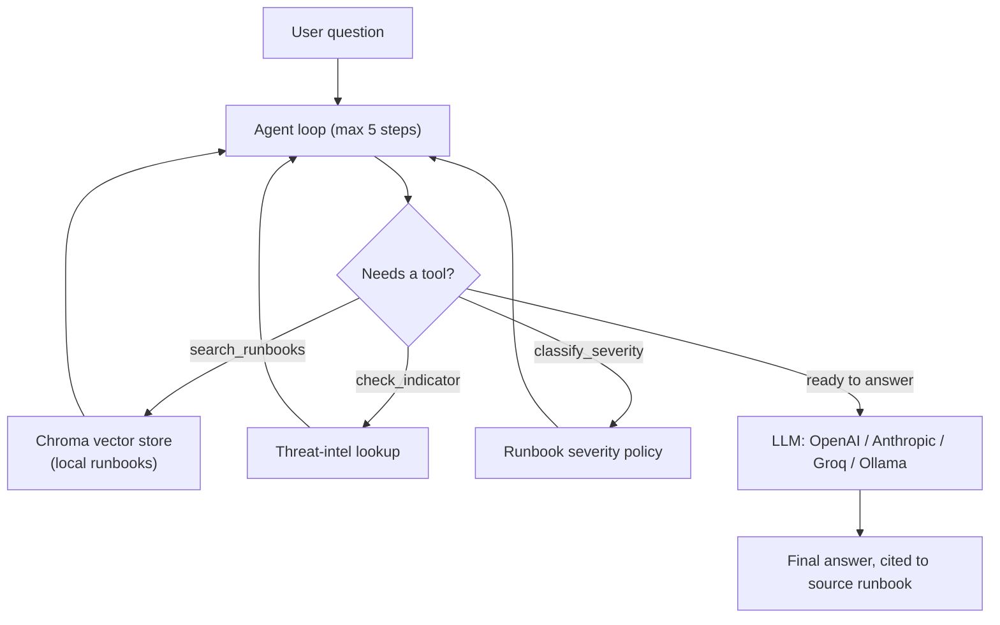
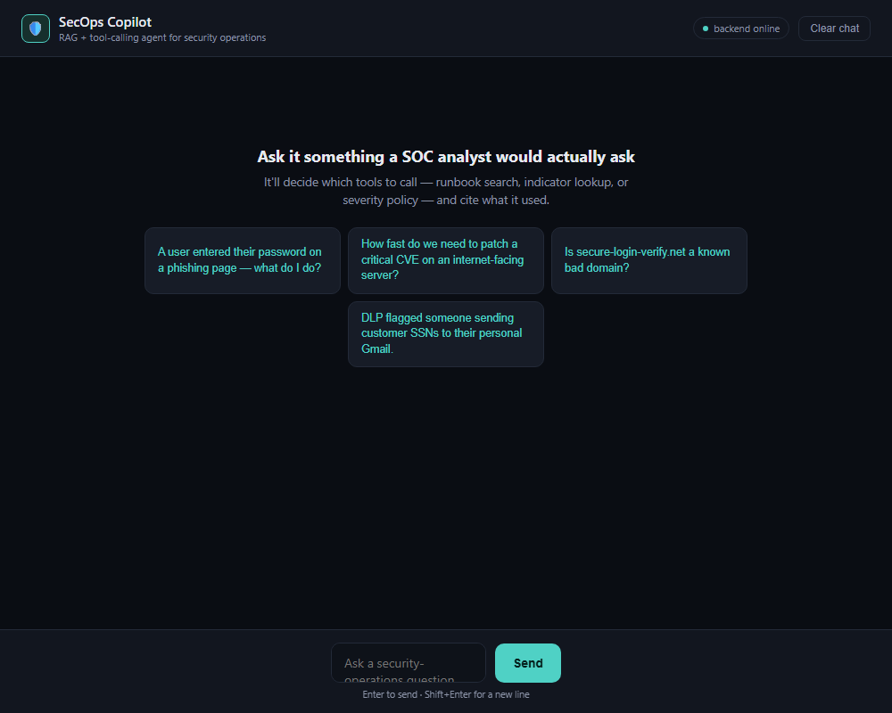
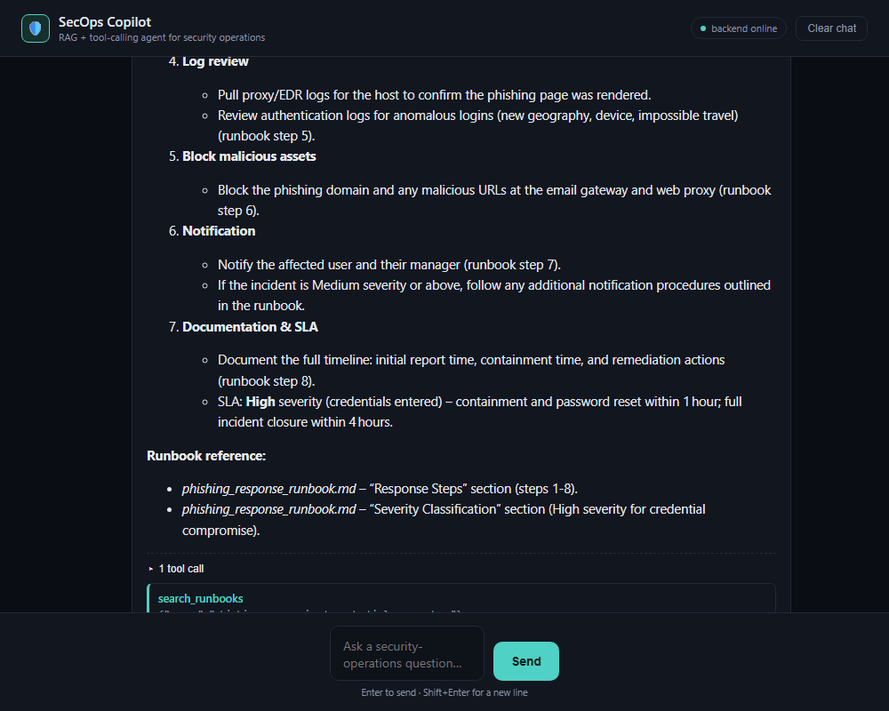

# SecOps Copilot

[](https://www.python.org/downloads/)
[](https://opensource.org/licenses/MIT)


SecOps Copilot is an open-source, retrieval-augmented AI assistant for security operations. It answers questions like *"a user entered their password on a phishing page, what do I do?"* by searching a local library of security runbooks and reference material, checking indicators of compromise against a threat-intel lookup, and reasoning step by step about which tool to call before giving a grounded, cited answer. Clone it, point it at your own internal docs, and run it for your team.

## Table of Contents
- [Why security operations](#why-security-operations-)
- [Architecture](#architecture-)
- [What it demonstrates](#what-it-demonstrates-)
- [Setup](#setup-)
- [Running this for $0](#running-this-for-0-)
- [Using it](#using-it-)
- [Running the eval suite](#running-the-eval-suite-)
- [Extending this project](#extending-this-project-)
- [Design decisions](#design-decisions-)
- [Contributing](#contributing)

## Why security operations 🔍

Security operations was chosen deliberately over a generic "chat with your PDFs" domain because it has exactly the properties that make RAG + tool-calling worth demonstrating: clear structured workflows (severity tiers, SLAs, escalation paths), concrete factual lookups (indicator-of-compromise checks), and classification tasks with well-defined policies. The runbooks and reference material in `sample_docs/` mirror real SOC workflows — SIEM alert triage, DLP incident handling, vulnerability management SLAs, phishing response, incident escalation, plus broader security knowledge (OWASP Top 10, common attack types, security frameworks, cryptography, and network security fundamentals). This gives the agent real structure to reason over, not just freeform text to parrot back.

## Architecture 🏗️



## Screenshots





## What it demonstrates 🛠️

| Skill | Where | How it works |
|---|---|---|
| RAG | `app/chunking.py`, `app/retriever.py` | Header-aware chunking (not naive fixed-size splitting) and a local Chroma vector store. Runs entirely offline with zero API cost for embeddings. |
| Tool-calling / agents | `app/tools.py`, `app/agent.py` | A bounded loop (capped at 5 steps) letting the model decide which of three tools to call, feeding results back in. The full trace is captured, not just the final answer. |
| Multi-provider LLM | `app/llm_client.py` | One interface routing to multiple backends (OpenAI, Anthropic, Groq, Ollama) via a configurable `base_url`, so the same code path works with paid APIs, free tiers, and local models. |
| Evaluation | `eval/golden_set.json`, `eval/run_eval.py` | Two layers: free deterministic checks (right tools called? right facts present?) for fast regression testing, plus an optional LLM-as-judge pass for deeper quality assessment. |
| Deployment | `app/api.py` | A FastAPI wrapper converting the underlying agent functions into an asynchronous HTTP service with a built-in chat UI. |

## Setup ⚙️

```bash
pip install -r requirements.txt
cp .env.example .env        # then fill in OPENAI_API_KEY or ANTHROPIC_API_KEY
python ingest.py            # builds the local vector store from sample_docs/
```

Ingestion needs no API key — it runs Chroma's local embedding model (all-MiniLM-L6-v2 via onnxruntime), which downloads once on first run. The LLM step (the actual agent reasoning and tool-calling) does need a real API key, since that part has to talk to OpenAI or Anthropic.

## Running this for $0 💸

You do not need a paid OpenAI or Anthropic key to use this project. `.env.example`
has three ready-to-use options, fully documented inline -- uncomment whichever one
you want in your `.env`:

- **Groq's free tier** (recommended if you just want it working fast): sign up at
  console.groq.com with no credit card, generate a key, and point `OPENAI_BASE_URL`
  at Groq's OpenAI-compatible endpoint. Free-tier rate limits are generous enough
  for running the eval suite and normal testing.
- **Ollama** (recommended if you want it fully offline): install Ollama, pull a
  tool-calling-capable model like `qwen2.5:7b`, and point `OPENAI_BASE_URL` at your
  local Ollama server. No signup, no internet needed after the model download,
  no rate limits -- just your own machine's compute.

Both work through the exact same `LLM_PROVIDER=openai` code path in
`app/llm_client.py`, because Groq and Ollama both implement an OpenAI-compatible
`chat.completions` API with tool-calling support -- the only thing that changes is
`OPENAI_BASE_URL`. Nothing else in the project needs to know or care which one
you're using.

One real tradeoff worth knowing: free/local models are noticeably weaker than
GPT-4o-mini or Claude at reliably picking the right tool to call, especially on
ambiguous questions. If you see `eval/run_eval.py` failing cases it wouldn't fail
on a paid model, that's expected -- it's actually a good, honest thing to have
noticed and be able to talk about (model choice is a real production tradeoff
between cost and tool-selection reliability, not just a config value).

## Using it 🚀

```bash
# one-off question from the command line
python ask.py "a user entered their password on a phishing page, what do I do"

# or run it as a service
uvicorn app.api:app --reload
curl -X POST localhost:8000/ask -H 'Content-Type: application/json' \
  -d '{"question": "how fast do we need to patch a critical CVE on an internet-facing server"}'
```

## Running the eval suite 🧪

```bash
python eval/run_eval.py            # fast, free, deterministic checks
python eval/run_eval.py --judge    # also scores each answer 1-5 with an LLM judge
```

Results are also written to `eval/last_run_results.json` for inspection.

## Extending this project 💡

A few natural next steps that add genuine value:

- **Swap in real API embeddings** (OpenAI `text-embedding-3-small`) instead of the local model and compare retrieval quality on tricky queries — a real production tradeoff (cost/latency vs. quality) worth understanding concretely.
- **Add a fourth tool** — e.g. a mock Splunk query tool, a WHOIS lookup, or a CVE database check. Writing the tool schema and the dispatch logic end to end is what makes this genuinely yours.
- **Add reranking** to the retriever — right now it's a single dense-vector search; production RAG systems often add a reranking step after initial retrieval to improve precision on the top results.
- **Point it at your own content.** Swap the sample runbooks for your organization's actual internal docs, NIST guides, or MITRE ATT&CK summaries — anything you'd actually want grounded answers from.

## Design decisions 🎯

A few choices worth explaining rather than leaving implicit:

- **The agent loop caps at 5 steps.** Without a hard limit, a confused model could
  loop indefinitely, calling tools without ever converging on an answer — and since
  every tool call also means an LLM call, that's a real, unbounded cost. Five steps
  is enough for any question this project's tools can actually answer; if it hits
  the cap, the trace shows exactly what it was trying to do so the failure is
  debuggable, not silent.
- **Evaluation has two layers on purpose.** Deterministic checks (right tools called,
  right facts present) are free and fast enough to run on every change. The optional
  LLM-as-judge pass costs a little money and is non-deterministic, so it's reserved
  for deeper review rather than every commit. Most self-taught RAG projects skip
  evaluation entirely — this is meant to show it doesn't have to be expensive to do
  at all.
- **Local embeddings by default.** Ingestion runs Chroma's bundled model, no API key
  or cost required. Swapping to an API embedding model (e.g. OpenAI's
  `text-embedding-3-small`) is a reasonable upgrade path once retrieval quality
  actually needs to improve — the local model is deliberately not the ceiling, just
  a free starting point.
- **Two-mode answers: grounded or labeled.** When the local knowledge base covers a
  question, the agent answers from it and cites the source document. When the
  knowledge base doesn't cover it (e.g. a general "what is a buffer overflow?"
  question), the agent answers from its own general cybersecurity knowledge instead
  of refusing — but explicitly labels the answer as general knowledge, not a cited
  source. This makes the assistant broadly useful without ever letting a user mistake
  an ungrounded answer for a cited one.

## Contributing

Issues and pull requests are welcome. If you extend this with a new tool or swap in
a different retrieval strategy, a short note in the PR about why is appreciated —
the goal of this project is to stay explainable, not just functional.
